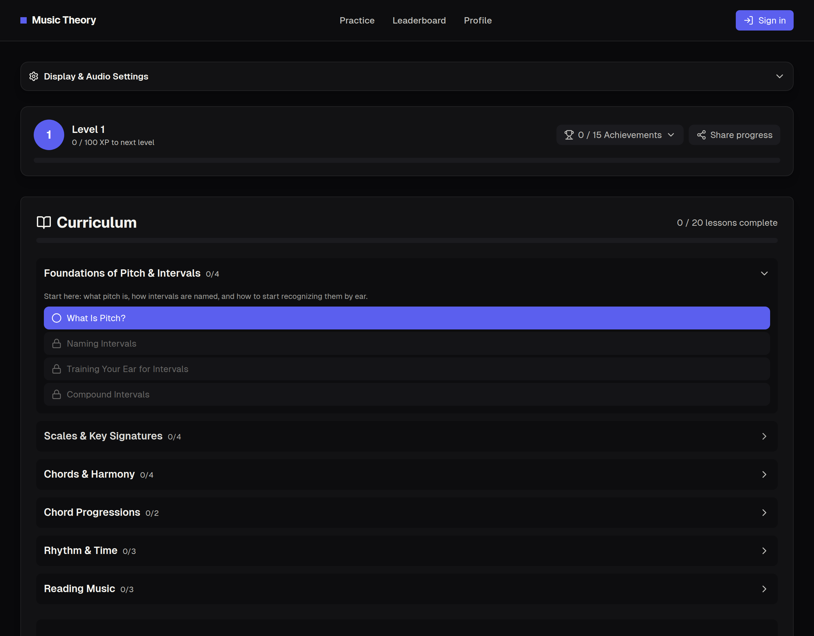
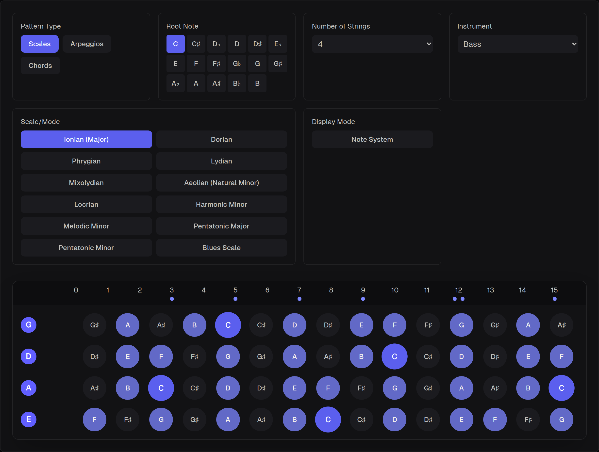
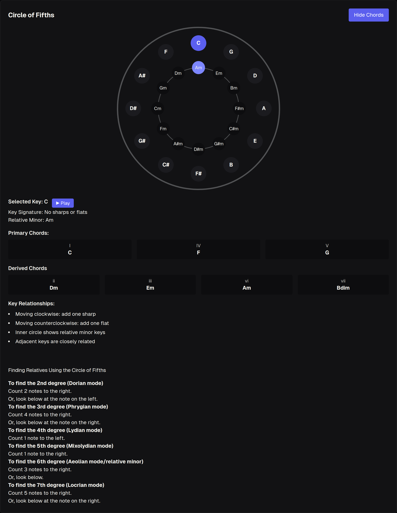
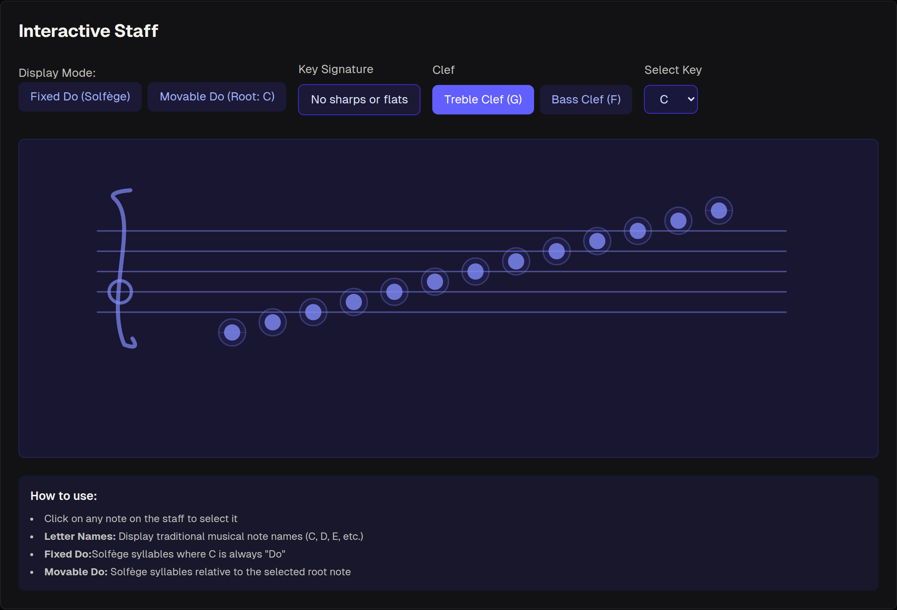
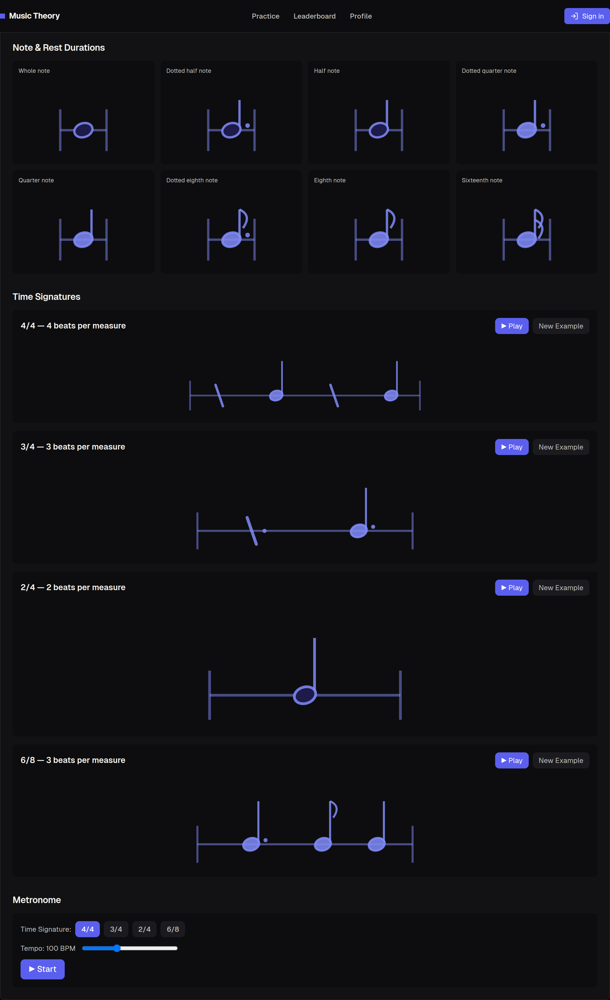
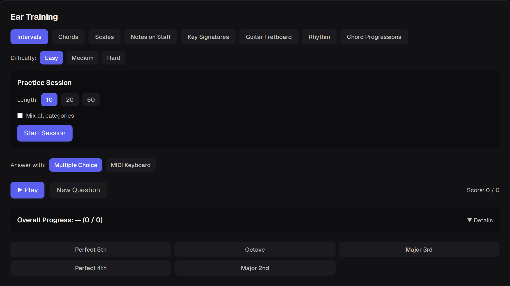
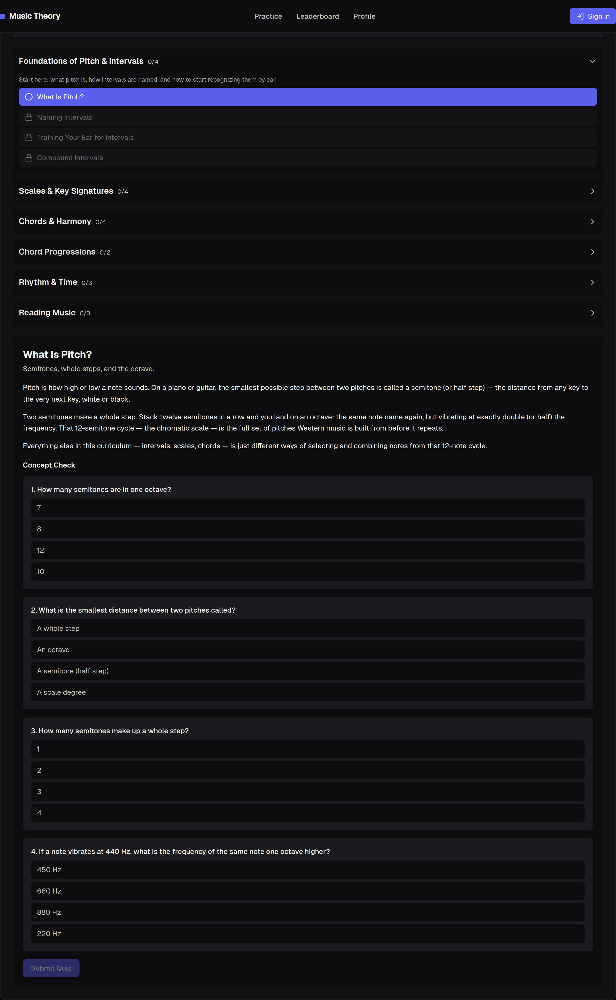
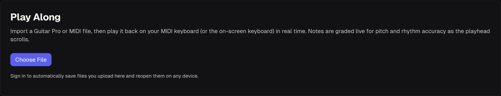
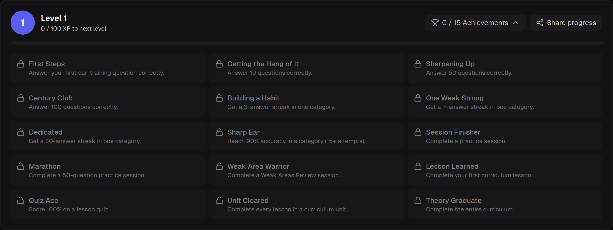
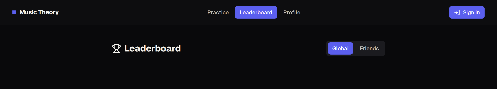

# Music Theory Cheatsheet

An interactive, all-in-one music theory practice platform: an explorable fretboard and staff, ear training with eight drill categories, a structured curriculum with spaced-repetition review, a play-along engine for your own MIDI/Guitar Pro files, gamification, and a social layer (profiles, follows, leaderboard, activity feed, friend challenges, notifications). It works fully as a guest with everything saved to `localStorage`, or with an optional Supabase backend for accounts and cross-device sync.



## Table of Contents

- [Features](#features)
- [Screenshots](#screenshots)
- [Tech Stack](#tech-stack)
- [Project Structure](#project-structure)
- [Getting Started](#getting-started)
- [Cloud Sync Setup (Optional)](#cloud-sync-setup-optional)
- [Integration Testing](#integration-testing)
- [Learn More](#learn-more)
- [Deploy on Vercel](#deploy-on-vercel)

## Features

### Practice tools

- **Fretboard Navigator** — visualize scales, arpeggios, and chords across a 4/5/6-string bass or any guitar tuning, in landmark numbers or note names. Click any fret to hear it through the built-in synth.
- **Circle of Fifths** — click around the wheel to hear scale degrees and chords; toggle chord mode to study key relationships at a glance.
- **Interactive Staff** — treble/bass clef toggle, click-to-play notes, and an optional note-name/solfège overlay.
- **On-screen Piano Keyboard** — a clickable "piano roll" wired into the same synth, plus optional Web MIDI input from a real keyboard/controller.
- **Rhythm Trainer** — note/rest durations, time signatures, and a built-in metronome so you can feel the beat, not just name it.

### Ear training

Eight drill categories — **Intervals, Chords, Scales, Notes on Staff, Key Signatures, Guitar Fretboard, Rhythm,** and **Chord Progressions** — across four difficulty tiers (**Easy, Medium, Hard, Expert**). Answer by clicking, on an on-screen keyboard, or over a connected MIDI device. Run single questions or a timed **Practice Session** (10/20/50 questions, single-category or mixed), with per-category accuracy, streak, and last-practiced tracking.

### Curriculum

Seven structured units (Foundations, Scales & Keys, Chords & Harmony, Progressions, Rhythm & Time, Reading Music, and Advanced Harmony) made up of 20+ lessons, each ending in a quiz that gates the next lesson. A **spaced-repetition review engine** resurfaces weak areas based on your ear-training accuracy.

### Play Along

Upload a **MIDI** or **Guitar Pro** file and practice against real notation — switch between rendered **staff + tab** (self-hosted Bravura font, full-page/paginated view, clef switching, click-and-drag loop selection) or a scrolling **Note Highway** (Yousician-style lanes with a real-time judged cursor). Includes **Wait Mode** (pauses until you play the right note), section looping, and on-the-fly **transpose**/re-tuning.

### Progress & gamification

XP and levels for overall practice, streak tracking for consistency, and 15 achievements that unlock on real milestones (lessons completed, accuracy hit, streaks kept) rather than vanity badges. Share a canvas-rendered progress card with one tap (Web Share API, with a clipboard fallback).

### Learning Plan

A personal `/plan` page combining **Up Next** (the next unfinished curriculum lesson), **Today's Practice** (a short session targeting your weakest ear-training categories), and a full curriculum **Roadmap** with per-unit completion counts.

### Social

- **Profiles** — public/private profile pages with a chosen username, avatar, and stats.
- **Follow graph** — follow/unfollow other musicians; following powers the leaderboard, feed, and challenge-opponent list.
- **Leaderboard** — global and Following-scoped XP rankings.
- **Activity feed** (`/feed`) — a Global/Following feed of achievement unlocks, level-ups, lesson completions, and challenge results, with emoji reactions and threaded comments on every item.
- **Friend challenges** (`/challenges`) — challenge a friend to a head-to-head ear-training session (pick category, difficulty, and length); accept/decline, play through a deep link, and see the score and winner once both sides finish.
- **Notifications** — a bell with an unread badge for new followers, challenge invites, and challenge results, with a dropdown of recent notifications.

### Accounts & cloud sync (optional)

Sign in with email/password, a magic link, or Google to sync practice progress, curriculum/review state, gamification, profiles, and saved Play Along files across devices — see [Cloud Sync Setup](#cloud-sync-setup-optional). Without it configured, everything above still works fully as a guest, `localStorage`-only experience.

### Themes & marketing site

A light/dark/psychedelic 3-way theme selector (the psychedelic theme adds subtle animated background mushrooms), plus a small marketing site (`/`, `/features`, `/community`) introducing the app and its social features.

## Screenshots

| | |
|---|---|
| **Fretboard Navigator**<br> | **Circle of Fifths**<br> |
| **Interactive Staff**<br> | **Rhythm Trainer**<br> |
| **Ear Training**<br> | **Curriculum**<br> |
| **Play Along**<br> | **Progress & Achievements**<br> |
| **Leaderboard**<br> | |

> Profiles, the activity feed, friend challenges, notifications, and the Learning Plan page were added after these screenshots were captured and don't have dedicated images yet — see the [Features](#features) section above for what they do.

## Tech Stack

- **[Next.js](https://nextjs.org)** (App Router, static export via `output: 'export'` — no server/API routes) with **React** and **TypeScript**
- **[Tailwind CSS](https://tailwindcss.com)** for styling, with [`next/font`](https://nextjs.org/docs/app/building-your-application/optimizing/fonts) loading [Geist](https://vercel.com/font)
- **Web Audio API** for the built-in synth engine, **Web MIDI API** for hardware keyboard input
- **[@coderline/alphatab](https://www.alphatab.net/)** for Guitar Pro file parsing (headless), plus a hand-rolled Standard MIDI File parser, both feeding a self-hosted Bravura-font notation renderer
- **[Supabase](https://supabase.com)** (Postgres + Auth + Storage + RLS) for optional accounts, cloud sync, and the social features
- **[ESLint](https://eslint.org)** (`eslint-config-next`) for linting, **[tsx](https://github.com/privatenumber/tsx)** for running the TypeScript integration test script

## Project Structure

```
app/
  page.tsx                 marketing home (/)
  features/, community/    marketing pages
  app/page.tsx              the practice app shell (/app)
  plan/page.tsx              Learning Plan page
  feed/page.tsx               activity feed
  challenges/page.tsx          friend challenges
  leaderboard/page.tsx          leaderboard
  profile/page.tsx                profile page
  components/                shared UI: EarTraining, Curriculum, PlayAlong, ScoreNotation,
                              NoteHighway, Fretboard, CircleOfFifths, StaffSection, PianoKeyboard,
                              RhythmSection, GamificationPanel, ProgressPanel, ReviewPanel,
                              AppHeader, AuthModal, Footer, ThemeWrapper, Mushrooms, ShareButton
  utils/                     localStorage-backed stores (progressStore, curriculumStore,
                              reviewStore, gamificationStore), Supabase-aware stores
                              (profileStore, activityStore, challengeStore, notificationStore),
                              pub/sub buses (practiceFocusBus, activityBus, challengeBus),
                              audio (audioSynth, useSynth, useMidiInput), file parsers
                              (midiFileParser, guitarProParser), and music-theory data/helpers
supabase/schema.sql         full Postgres schema + RLS policies for every Supabase table
scripts/test-integration.ts Supabase data-layer integration test suite (see below)
```

## Getting Started

To get started with the project, clone the repository and install the necessary dependencies:

```bash
git clone https://github.com/olteanalexandru/Music-theory-cheatsheet.git
cd Music-theory-cheatsheet
npm install
npm run dev
```

Open [http://localhost:3000](http://localhost:3000) with your browser to see the result.

You can start editing the page by modifying `app/page.tsx`. The page auto-updates as you edit the file.

Other useful commands:

```bash
npm run build     # production build — static export to ./out (output: 'export' in next.config.ts)
npx serve out     # preview the production build by serving ./out (next start does not work with output: 'export')
npm run lint       # eslint
npm run test:integration   # Supabase data-layer integration tests, see below
```

## Cloud Sync Setup (Optional)

Sign-in, practice progress sync, and saved Play Along files are powered by [Supabase](https://supabase.com). Without it configured, the app works fully as a guest-only, localStorage-only experience — the "Sign in" button stays disabled with an explanatory note. To turn cloud sync on:

1. **Create a Supabase project** at [supabase.com](https://supabase.com) (the free tier is enough).
2. **Run the schema migration**: open your project's *SQL Editor* and run the contents of [`supabase/schema.sql`](./supabase/schema.sql). This creates the `progress`, `curriculum_progress`, `review_progress`, `gamification`, `uploaded_files`, `profiles`, `follows`, `activity_events`, `activity_comments`, `activity_reactions`, `challenges`, and `notifications` tables (with row-level security so each user can only see their own data, except `profiles` rows marked public and their related rows — `gamification`, activity feed events, etc. — which are readable by anyone for the leaderboard/profile/feed pages) and a private `play-along-files` storage bucket for saved Guitar Pro / MIDI files.
3. **Copy your API credentials**: in *Project Settings -> API*, copy the *Project URL* and the *anon public* key.
4. **Set environment variables**: copy `.env.example` to `.env.local` and fill in:
   ```
   NEXT_PUBLIC_SUPABASE_URL=https://your-project.supabase.co
   NEXT_PUBLIC_SUPABASE_ANON_KEY=your-anon-key
   ```
   Restart `npm run dev` (or rebuild, for a static export deploy) after changing these — they're inlined at build time.
5. **Enable email sign-in** (on by default): in *Authentication -> Providers*, the Email provider is already enabled, which covers password sign-up and magic-link sign-in. If you want to skip email confirmation for quicker testing, turn off "Confirm email" under *Authentication -> Settings*.
6. **Enable Google sign-in (optional)**: the "Continue with Google" button is already wired up — it just needs a provider:
   - In [Google Cloud Console](https://console.cloud.google.com/apis/credentials), create an OAuth 2.0 Client ID (type: Web application). Add `https://<your-project-ref>.supabase.co/auth/v1/callback` as an authorized redirect URI.
   - In Supabase, go to *Authentication -> Providers -> Google*, enable it, and paste in the Client ID and Client Secret from Google Cloud.
   - That's it — no code changes needed once the provider is enabled.

Once configured, signing in will automatically merge any existing localStorage progress into the cloud, then keep both in sync going forward.

**Troubleshooting a 403 on `uploaded_files` or `play-along-files`**: this happens if `schema.sql` was run more than once before its policies were idempotent — an early `CREATE POLICY` would fail with "policy already exists" and abort the script before reaching the `uploaded_files` table or storage bucket policies near the end. The script now drops each policy before recreating it, so just re-run the current [`supabase/schema.sql`](./supabase/schema.sql) in the SQL Editor again to fix it.

## Integration Testing

`npm run test:integration` runs [`scripts/test-integration.ts`](./scripts/test-integration.ts), which exercises the Supabase data layer end-to-end against a real Supabase project — the same store functions (`profileStore.ts`, `activityStore.ts`, `challengeStore.ts`, `notificationStore.ts`, etc.) the browser app calls. Since this app has no Next.js API routes (`next.config.ts` sets `output: 'export'`), this is the closest equivalent to an "API route test suite": it signs in as disposable test accounts with the anon key and asserts on real row-level-security behavior, rather than bypassing it.

To run it:

1. Make sure `.env.local` has `NEXT_PUBLIC_SUPABASE_URL` and `NEXT_PUBLIC_SUPABASE_ANON_KEY` set (see [Cloud Sync Setup](#cloud-sync-setup-optional) above).
2. Add one more variable: `SUPABASE_SERVICE_ROLE_KEY` (from *Project Settings -> API -> service_role*). This key is **test-only** — it's used solely by this script to create and delete disposable test accounts, and is never read by the Next.js app itself. Never commit a real value for it.
3. Run `npm run test:integration`.

The script creates a few throwaway accounts, runs through profile/follow/gamification/sync-table/leaderboard/activity-feed/challenge/notification/storage scenarios (covering both allowed access and expected RLS denials), prints a PASS/FAIL line per scenario, deletes the test accounts again, and exits non-zero if anything failed.

⚠️ Run this only against a project you're comfortable seeding with test data — it's safe to run repeatedly (test users are cleaned up automatically), but it does write real rows during the run, and a crash before the `finally` cleanup block would leave the disposable users behind for manual deletion.

## Learn More

To learn more about Next.js, take a look at the following resources:

- [Next.js Documentation](https://nextjs.org/docs) - learn about Next.js features and API.
- [Learn Next.js](https://nextjs.org/learn) - an interactive Next.js tutorial.

You can check out [the Next.js GitHub repository](https://github.com/vercel/next.js) - your feedback and contributions are welcome!

## Deploy on Vercel

The easiest way to deploy your Next.js app is to use the [Vercel Platform](https://vercel.com/new?utm_medium=default-template&filter=next.js&utm_source=create-next-app&utm_campaign=create-next-app-readme) from the creators of Next.js.

Check out our [Next.js deployment documentation](https://nextjs.org/docs/app/building-your-application/deploying) for more details.
